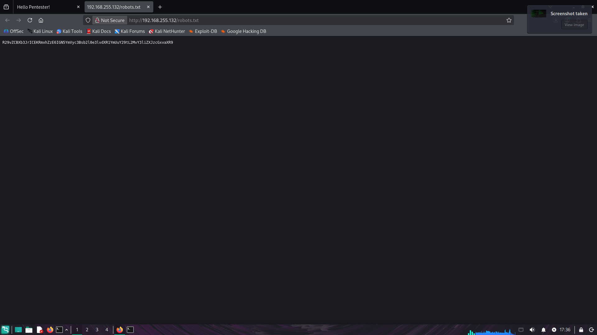
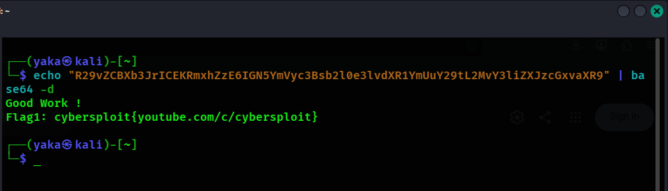
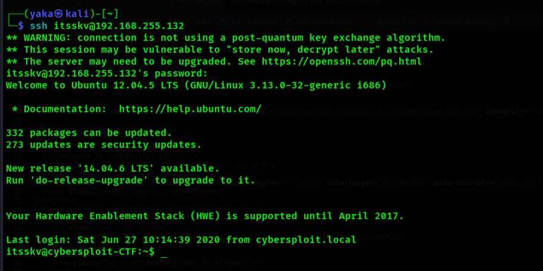
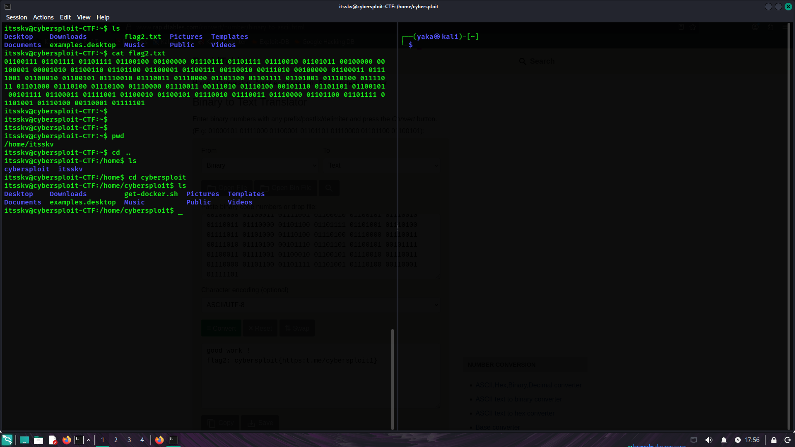
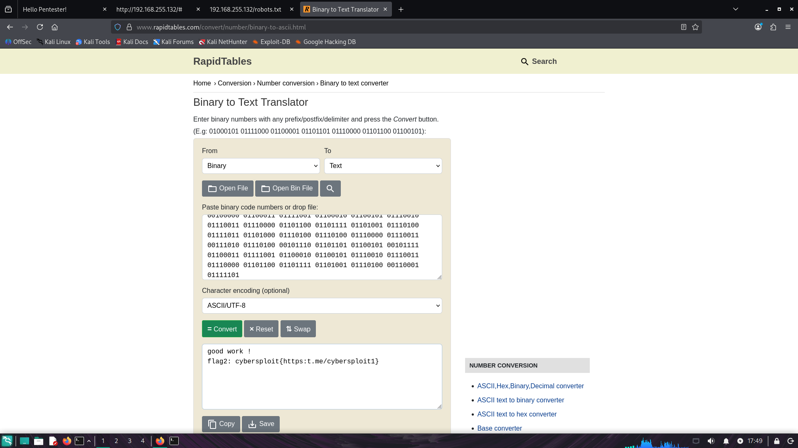
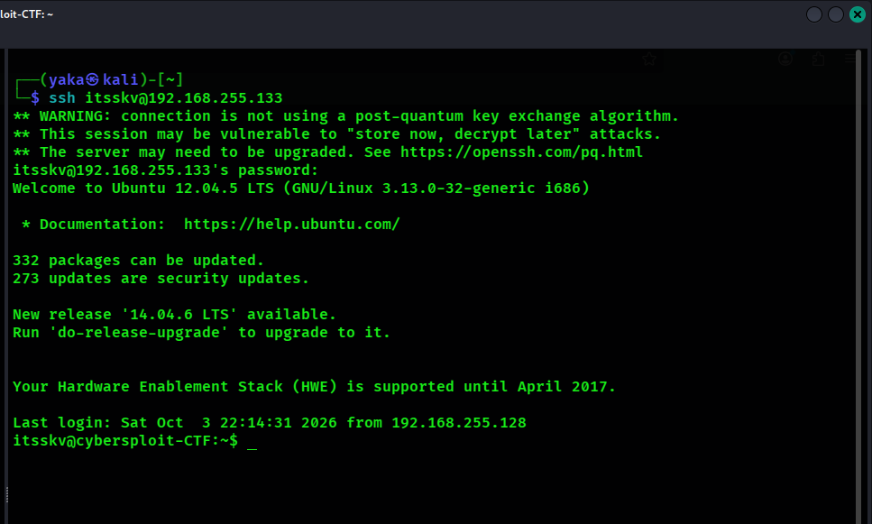
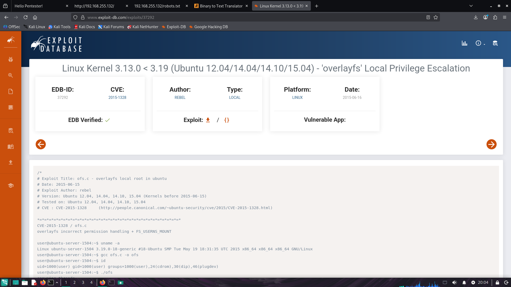

><mark>🔴 (Failed Attempt) — Indicates an approach that did not produce a useful result and was not pursued further.</mark>

 

| Step No. | Command | Explanation | Output of the Command | Takeaway |
|---:|---|---|---|---|
| **1** | `ifconfig` | It display the machine’s network interfaces and identify the assigned IP address and subnet mask. The IP address and subnet mask can then be used to determine the network ID. |  | The host is on the `192.168.255.0/24` network. The assigned IP address is `192.168.255.128`. |
| **2** | `sudo netdiscover -r 192.168.255.0/24` |  It scans the 192.168.255.0/24 network and discover active devices on the local network. It identifies hosts by sending ARP requests and can display information such as their IP addresses, MAC addresses, and device/vendor details. |  | The output shows the IP address, MAC address, and vendor information for each discovered device. In this lab environment, `192.168.255.1` is the adapter IP address, `192.168.255.2` is the gateway, and `192.168.255.254` is the DHCP server based on the lab configuration. The host at `192.168.255.131` is identified as the target/victim machine because it has a different MAC address from the other identified network devices, indicating that it is a separate host on the network. |
| **3** | `nmap 192.168.255.132 -sV -p-` |  It scans all TCP ports on the specified machine and identifies open ports along with the services and their versions running on them. |  | It identifies two open ports on the victim machine: port 22, which is running SSH, and port 80, which is running HTTP. |
| **4** | `searchsploit OpenSSH 5.9p1` | It searches the Exploit Database for known vulnerabilities and exploits related to the OpenSSH 5.9p1 version. |  | 🔴 Since no relevant exploit or exact version match was found, this approach was not pursued further. |
| **5** | `searchsploit Apache httpd 2.2.22` | It searches the Exploit Database for known vulnerabilities or exploits affecting Apache HTTP Server 2.2.22. |  | 🔴 Since no relevant exploit or exact version match was found, this approach was not pursued further. |
| **6** | `-` | Checking the web service hosted on `port 80.` |  | The website is functioning properly, so we should investigate it further to identify any potential security vulnerabilities. |
| **7** | `-` | Inspecting the website’s source code to identify any useful information. |  | The source code contains a username `itsskv` in a comment, which may be useful for identifying a potential account or for further authorized testing. |
| **8** | `-` | We will download the GIF from the website and analyze its metadata to determine whether it contains any useful information. |  | 🔴 The GIF does not contain any useful metadata, so I will not pursue this approach further. |
| **9** | `dirb http://192.168.255.132` |  It scans the web server for hidden or unlisted directories and files that may provide additional information about the website. |  | The scan found a `robots.txt` file, which may contain useful information about directories that should not be indexed. The next step is to inspect the file and review any paths it references. |
| **10** | `-` | Inspecting the `robots.txt` file discovered during the directory scan to identify any referenced files or directories worth investigating further. |  | We found a text string that appears to be encrypted or encoded. The next step is to decrypt or decode it to reveal its contents and check for useful information. |
|  **11** | `echo "R29vZCBXb3JrICEK` `RmxhZzE6IGN5YmVyc3Bsb2` `l0e3lvdXR1YmUuY29tL2Mv` `Y3liZXJzcGxvaXR9" \| base64 -d` | When I find an encoded string, my usual first step is to try Base64 decoding to check whether it reveals readable text. |  | Decoding the string revealed the first flag: `Cybersploit{youtube.com/c/cybersploit}`. |
| **12** | `ssh itsskv@192.168.255.132` | Since this approach led to a dead end, the next step is to attempt to log in through SSH. |  | Using the first flag `(Cybersploit{youtube.com/c/cybersploit})` as the SSH password successfully authenticated the login and granted access to the target machine. |
| **13** | `ls` `&&` `cat flag2.txt` | Running `ls` as my usual first step after gaining access to the target machine to see the files and directories in the current directory. |  | Inspecting `flag2.txt` revealed another encoded string containing only `1`s and `0`s, suggesting it may be binary-encoded text. |
| **14** | `-` | Searched for an online binary-to-text decoder and pasting the encoded string into it to reveal the readable text. |  | Decoding the binary string revealed the second flag: `"cybersploit{https:t.me/cybersploit1}"`. |
| **15** | `-` | After gaining SSH access to the target machine, the next step is to obtain root privileges to locate the third and final flag. |  | The Ubuntu version displayed during login may help identify known exploits that could allow privilege escalation. |
| **16** | `-` | Searching Google for the identified Ubuntu version to check for known privilege escalation exploits. |  | The search returned potential exploits. The next step is to review their entries in Exploit Database to check whether they apply to the target machine. |
| **17** | `-` | Reviewing the exploit details in Exploit Database, including the associated CVE, CVSS severity score where available, affected versions, and requirements, to assess whether it applies to the target machine. |  | **Vulnerability:** CVE-2013-2094 - Linux kernel local privilege escalation. **Severity:** High. **Score:** CVSS v2: <mark>**7.2/10**</mark>; CVSS v3.1 (CISA-ADP): <mark>**8.4/10**</mark>. **What it does:** May allow a local user to gain root privileges. **Impact:** Could allow access to restricted files, modification of system data, and disruption of the machine. |