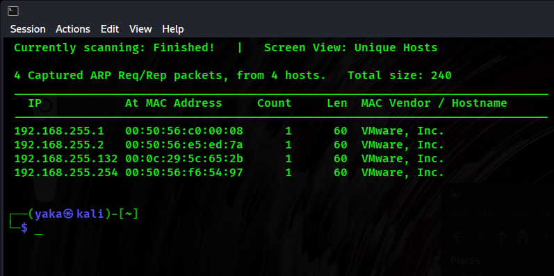
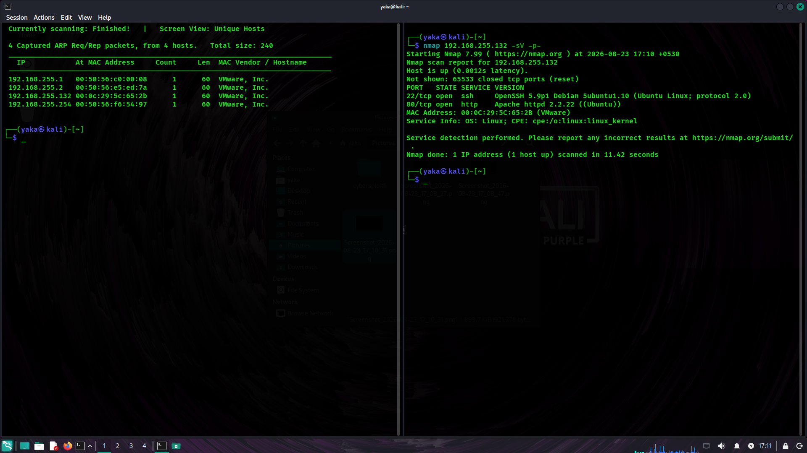
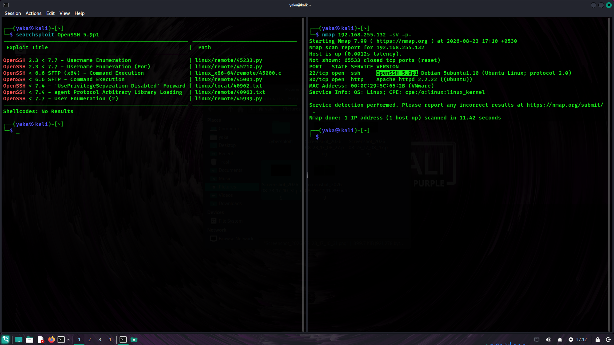
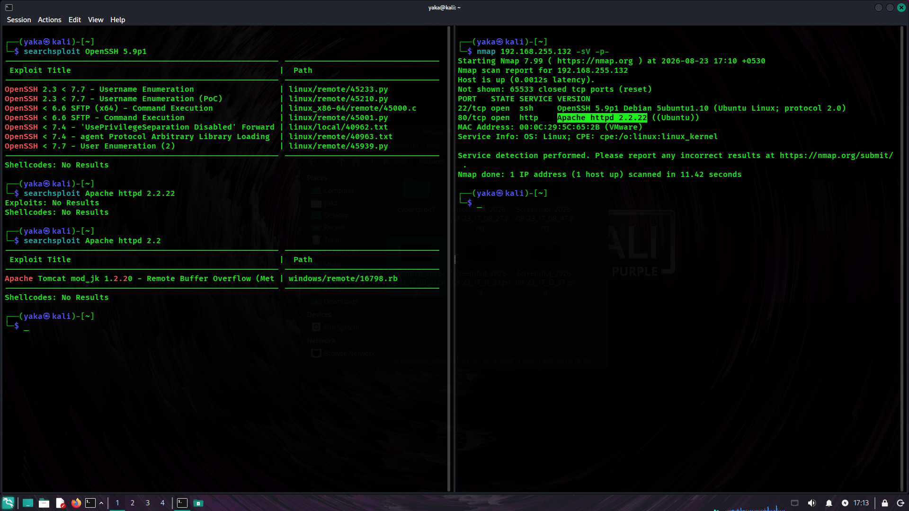
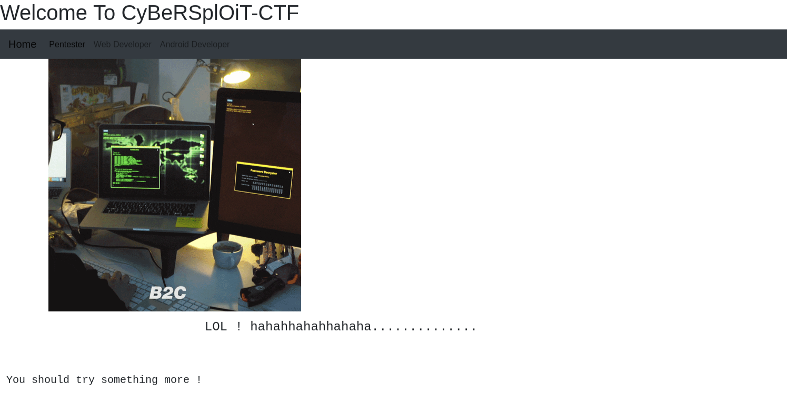
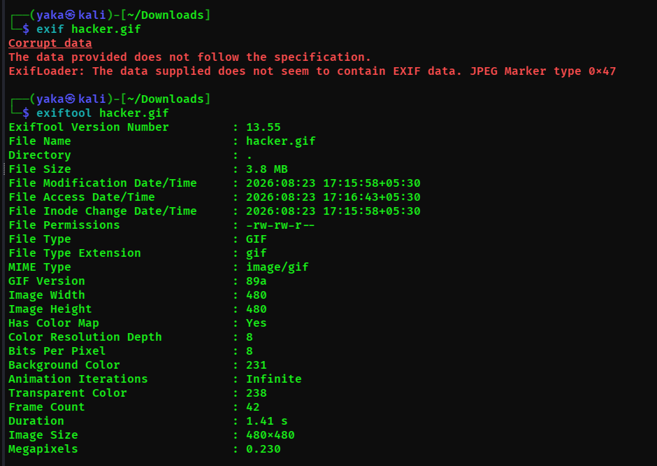
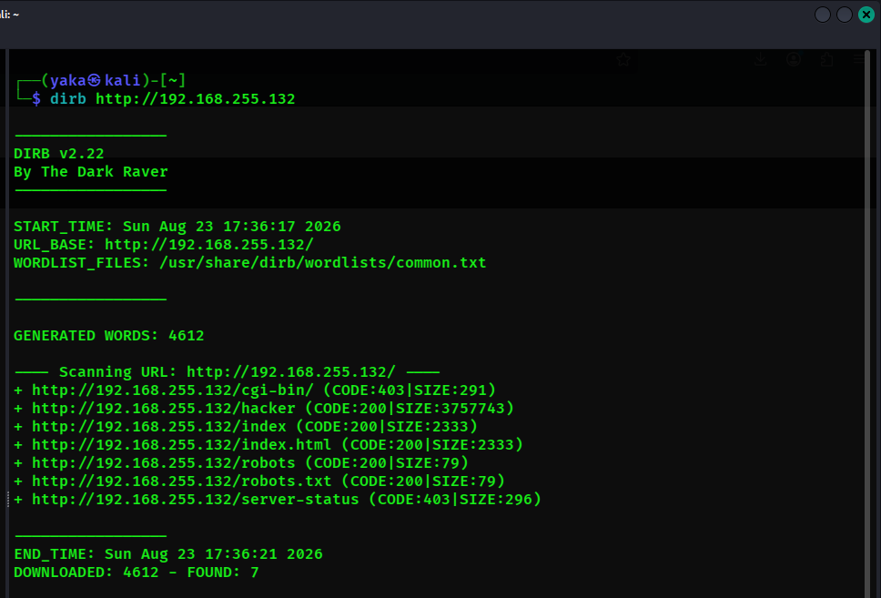

>🔴 (Failed Attempt) — Indicates an approach that did not produce a useful result and was not pursued further.
 
| Step No. | Command | Explanation | Output of the Command | Takeaway |
|---:|---|---|---|---|
| **1** | `ifconfig` | It display the machine’s network interfaces and identify the assigned IP address and subnet mask. The IP address and subnet mask can then be used to determine the network ID. |  | The host is on the `192.168.255.0/24` network. The assigned IP address is `192.168.255.128`. |
| **2** | `sudo netdiscover -r 192.168.255.0/24` |  It scans the 192.168.255.0/24 network and discover active devices on the local network. It identifies hosts by sending ARP requests and can display information such as their IP addresses, MAC addresses, and device/vendor details. |  | The output shows the IP address, MAC address, and vendor information for each discovered device. In this lab environment, `192.168.255.1` is the adapter IP address, `192.168.255.2` is the gateway, and `192.168.255.254` is the DHCP server based on the lab configuration. The host at `192.168.255.131` is identified as the target/victim machine because it has a different MAC address from the other identified network devices, indicating that it is a separate host on the network. |
| **3** | `nmap 192.168.255.132 -sV -p-` |  It scans all TCP ports on the specified machine and identifies open ports along with the services and their versions running on them. |  | It identifies two open ports on the victim machine: port 22, which is running SSH, and port 80, which is running HTTP. |
| **4** | `searchsploit OpenSSH 5.9p1` | It searches the Exploit Database for known vulnerabilities and exploits related to the OpenSSH 5.9p1 version. |  | 🔴 Since no relevant exploit or exact version match was found, this approach was not pursued further. |
| **5** | `searchsploit Apache httpd 2.2.22` | It searches the Exploit Database for known vulnerabilities or exploits affecting Apache HTTP Server 2.2.22. |  | 🔴 Since no relevant exploit or exact version match was found, this approach was not pursued further. |
| **6** | `-` | Checking the web service hosted on `port 80.` |  | The website is functioning properly, so we should investigate it further to identify any potential security vulnerabilities. |
| **7** | `-` | Inspecting the website’s source code to identify any useful information. |  | The source code contains a username `itsskv` in a comment, which may be useful for identifying a potential account or for further authorized testing. |
| **8** | `-` | We will download the GIF from the website and analyze its metadata to determine whether it contains any useful information. |  | 🔴 The GIF does not contain any useful metadata, so I will not pursue this approach further. |
| **9** | `dirb http://192.168.255.132` |  It scans the web server for hidden or unlisted directories and files that may provide additional information about the website. |  | The scan found a `robots.txt` file, which may contain useful information about directories that should not be indexed. The next step is to inspect the file and review any paths it references. |
| **10** | `-` | 