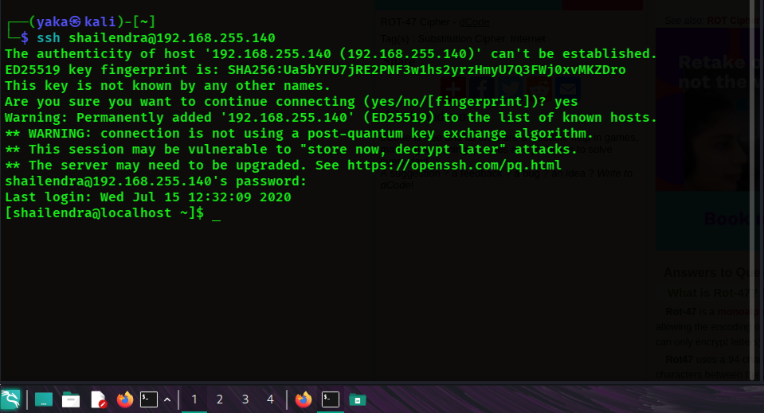
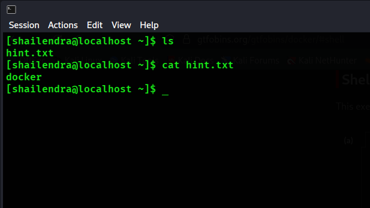
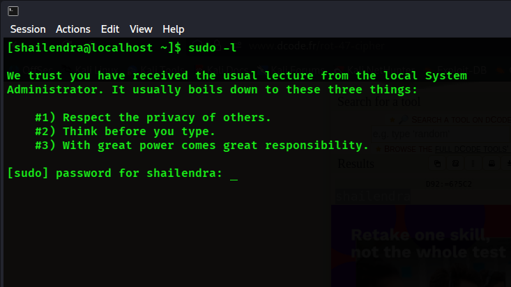
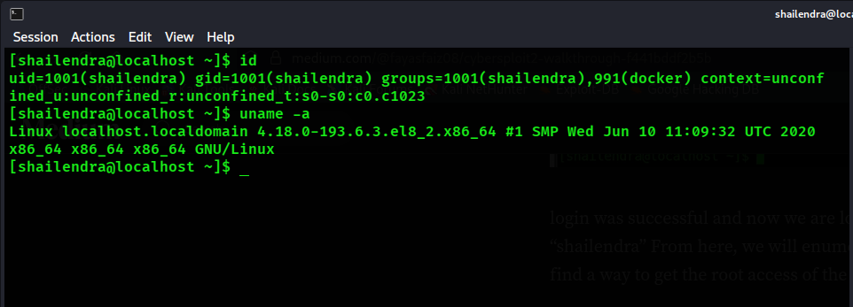
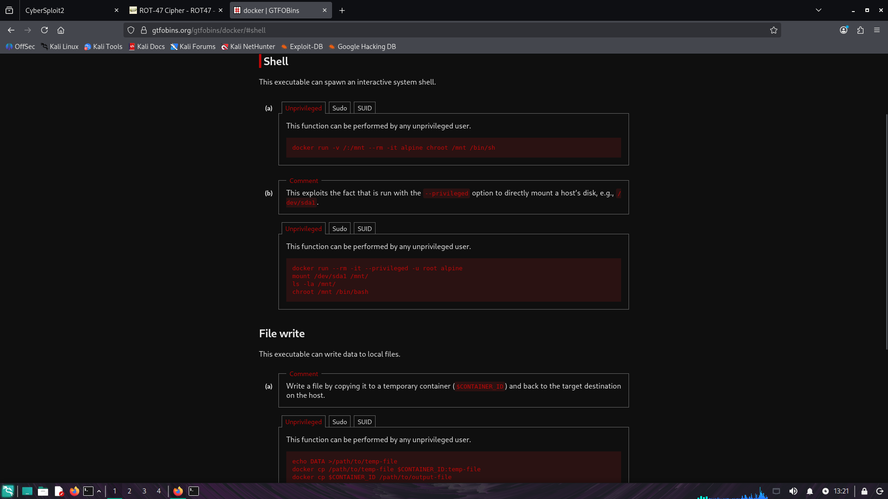
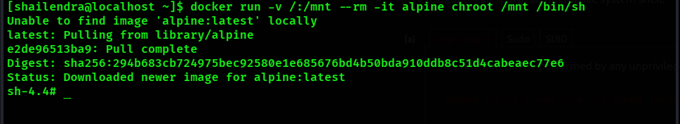
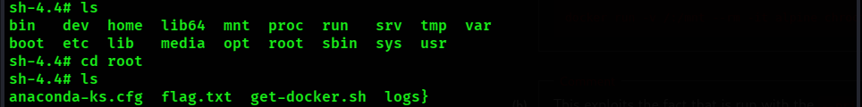
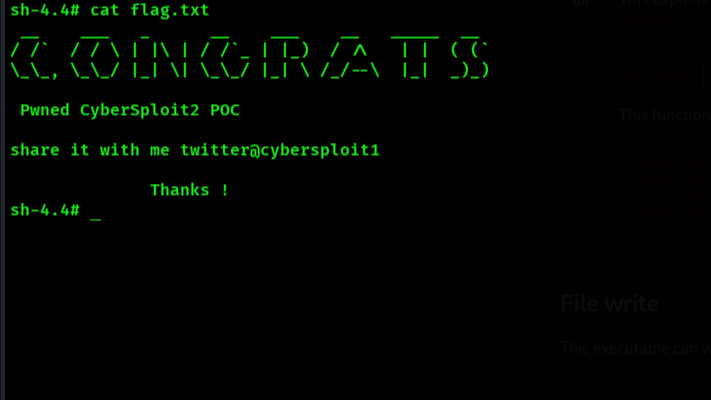

><mark>🟢 (Successful Flag Retrieval) — Indicates that the flag was successfully retrieved.</mark> 
><mark>🔴 (Failed Attempt) — Indicates an approach that did not produce a useful result and was not pursued further.<mark>

 
 

| Step No. | Command | Explanation | Output of the Command | Takeaway |
|---:|---|---|---|---|
| **1** | `ifconfig` | It display the machine’s network interfaces and identify the assigned IP address and subnet mask. The IP address and subnet mask can then be used to determine the network ID. |  | The host is on the `192.168.255.0/24` network. The assigned IP address is `192.168.255.128`. |
| **2** | `sudo netdiscover -r 192.168.255.0/24` |  It scans the 192.168.255.0/24 network and discover active devices on the local network. It identifies hosts by sending ARP requests and can display information such as their IP addresses, MAC addresses, and device/vendor details. |  | The output shows the IP address, MAC address, and vendor information for each discovered device. In this lab environment, `192.168.255.1` is the adapter IP address, `192.168.255.2` is the gateway, and `192.168.255.254` is the DHCP server based on the lab configuration. The host at `192.168.255.140` is identified as the target/victim machine because it has a different MAC address from the other identified network devices, indicating that it is a separate host on the network. |
| **3** | `nmap 192.168.255.140 -sV -p-` |  It scans all TCP ports on the specified machine and identifies open ports along with the services and their versions running on them. |  | It identifies two open ports on the victim machine: port 22, which is running 8SSH, and port 80, which is running HTTP. |
| **4** | `searchsploit OpenSSH 8.0` | It searches the Exploit Database for known vulnerabilities and exploits related to the OpenSSH .0 version. |  | 🔴 Since no relevant exploit or exact version match was found, this approach was not pursued further. |
| **5** | `searchsploit Apache httpd 2.4.37` | It searches the Exploit Database for known vulnerabilities or exploits affecting Apache HTTP Server 2.4.37. |  | 🔴 Since no relevant exploit or exact version match was found, this approach was not pursued further. |
| **6** | `-` | Checking the web service hosted on `port 80.` |  | The website is functioning properly, and we can see some usernames and passwords. I think these may be related to an SSH connection, so we should investigate further to understand what they are used for and identify the best way to move forward. |
| **7** | `-` | Inspecting the website’s source code to identify any useful information. |  | The source code mentions `Rot47` in a comment, which is an encryption method used to transform plain text into an unreadable format. We can also see some unreadable text in row 4 of the exposed table, which may have been encrypted using `Rot47`. |
| **8** | `-` |  We can use an online tool to decode the encrypted username using Rot47. |  |  As suspected, decrypting the username using *Rot47* reveals `shailendra`, confirming that the encoded value was indeed using the Rot47 method. |
| **9** | `-` |  Lets use the same online tool to decode the password as well. | ![decrypted [password]](screenshots/pswrd.png) | Decrypting the password with *Rot47* gives us `cybersploit1`. Since we now have both the username and password, we can try SSH and see if that’s a good way to move forward. |
| **10** | `ssh shailendra@192.168.255.140` | We’re trying to log in using the credentials we found through an SSH connection. |  | We successfully connected to the machine using the username `shailendra` and the password `cybersploit1`, which gave us access to the shell. |
| **11** | `ls` `cat hint.txt` | Running `ls` as my usual first step after gaining access to the target machine to see the files and directories in the current directory. Then I noticed a text file called `hint.txt`. I was curious to see what was inside, so I used `cat` to read it.|  | The `hint.txt` file points us toward Docker. Docker can be a potential privilege escalation vector when a user has permission to interact with the Docker daemon. |
| **12** | `sudo -l` | It allows you to check which commands the current user is allowed to run with sudo privileges. |  | 🔴 I tried to check if the user had any sudo privileges that could help with privilege escalation. Unfortunately, there was nothing useful, so that path didn’t work out. We’ll focus on Docker instead. |
|**13** | `id` |  The id command shows information about the current user, including their `username`, `user ID` (UID), and the groups they belong to. |  | It confirmed that the shailendra user is part of the docker group `991(docker)`. This is an important finding because Docker group membership can provide access to the Docker daemon, which may be abused for privilege escalation. Based on this, Docker looks like the most promising path to obtain root access. |
| **14** | `-` |  I checked `GTFOBins` for Docker and found a shell technique that looked promising. It can be used by an `unprivileged user`, so I decided to give it a try and see if it works on the machine. |  | Since the user is already part of the docker group, this technique could give us a way to interact with the Docker daemon and potentially escalate our privileges. This looks like our best option to try next. |
| **15** | `docker run -v /:/mnt --rm` `-it alpine chroot /mnt /bin/sh` | We used the Docker command from GTFOBins to start an Alpine Linux container. The `-v /:/mnt` part mounts the machine's main filesystem `(/)` inside the container at `/mnt`. Then, `chroot /mnt` changes the container's root directory to the mounted filesystem.   Because Docker is running with root privileges, this gives us a root shell on the host machine. In simple terms, we used our Docker group access to escape the container and get root access to the machine. |  | The command worked as expected and gave us a root shell on the machine. This confirms that membership in the docker group could be abused for privilege escalation and was the intended path to root. |
| **16** | `ls` `cd /root` | Once I get a root shell, one of my usual steps is to run `ls` to see what’s available in the current directory. We can also directly use `cd /root` to move into the root user's home directory and then run ls to check its contents. |  | Inside the /root directory, we found `flag.txt`, confirming that we had successfully obtained root-level access. |
| **17** | `cat flag.txt` |  Whenever I come across an interesting `.txt` file or something that catches my attention, I’ll definitely use `cat` to see what’s inside. |  | 🟢 And that’s a wrap! We successfully found the flag and completed the box. The final output revealed the success message: `"CONGRATS Pwned CyberSploit2 POC"` |